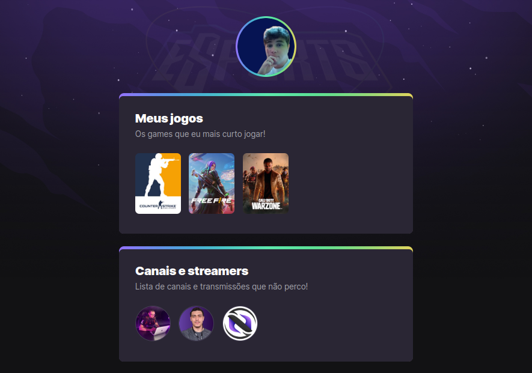

# NLW eSports

> Trilha Explorer

Projeto construido no evento Next Level Week da Rocketseat.

  <a href="#-tecnologias">Tecnologias</a>&nbsp;&nbsp;&nbsp;|&nbsp;&nbsp;&nbsp;
  <a href="#-projeto">Projeto</a>&nbsp;&nbsp;&nbsp;|&nbsp;&nbsp;&nbsp;
  <a href="#-layout">Layout</a>&nbsp;&nbsp;&nbsp;|&nbsp;&nbsp;&nbsp;

 

[Clique aqui para acessar](https://nlw-e-sports.netlify.app)

## 🚀 Tecnologias

Esse projeto foi desenvolvido com as seguintes tecnologias:

- ReactJS
- Javascript
- CSS
- Git e Github

## 💻 Projeto

Nessa NLW eSports a ideia desse projeto foi fazer um agregador de links para listar seus jogos e streamers favoritos.

## 🔖 Layout

Você pode visualizar o layout do projeto através [desse link](https://www.figma.com/community/file/1150897317533332617). É necessário ter conta no [Figma](https://figma.com) para acessá-lo.

---

Feito com ♥ by Bruno Gonçalves Ferreira
